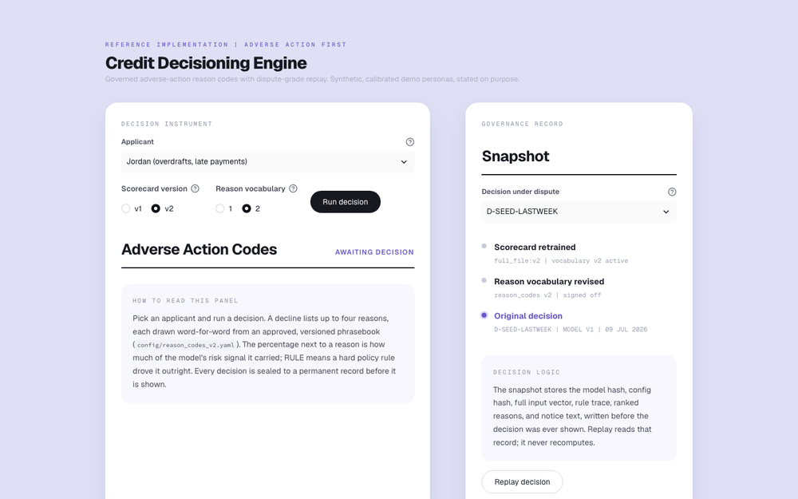
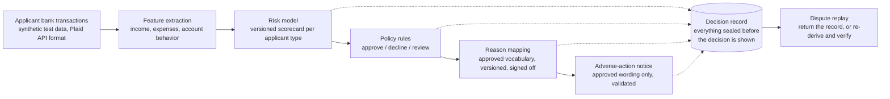

# Explainable Credit Decisioning with FCRA-Grade Reason Codes

A deliberately scoped working credit-decisioning engine, built around one question: when a machine learning model declines a loan applicant and the applicant disputes it 90 days later, after the model has been retrained twice, can you reproduce the original decision and its legally required reasons, exactly?

**The hypothesis:** adverse-action reason codes are not a reporting feature; they are a governed contract that belongs in the decision path, with every decision snapshotted for exact replay. Lenders that move underwriting onto complex, frequently retrained models without that architecture will hit a compliance bottleneck that model quality cannot buy them out of. This repo tests the hypothesis by building the architecture end to end.

Built by Samidha Visai. Python, scikit-learn, pydantic, SQLite, Streamlit. Clone and run with zero API keys. Sources for every claim are in [References](#references).



## The problem

A lender moves underwriting onto a machine learning model. Ninety days after a decline, the applicant disputes. Between then and now the model retrained, a feature was renamed, and compliance revised the approved reason wording. The lender must now produce the specific principal reasons for that decline, as they were, under ECOA Regulation B and FCRA.

The regulatory floor here is explicit and recently reinforced. CFPB Circular 2022-03: a creditor "cannot justify noncompliance with ECOA and Regulation B's requirements based on the mere fact that the technology it employs to evaluate applications is too complicated or opaque to understand" [1]. Circular 2023-03: creditors may not rely on checklist reasons that "do not specifically and accurately indicate the principal reason(s)" [2]. Getting this wrong is not theoretical: LendUp issued 71,800+ adverse-action notices that failed to accurately state reasons and is no longer lending [5]; Citibank's 2023 consent order involved pretextual denial reasons on notices [6].

How does the industry square that floor with complex models? The established mechanism is deriving reason codes from post-hoc attribution methods; there are issued US patents on generating adverse-action reason codes from SHAP values [7], and vendors market the capability openly [8]. Whether that mechanism is sufficient is genuinely contested. The FinRegLab/Stanford empirical study of explainability tools in credit found that tool quality varies enormously (the weakest performed no better than randomly chosen features), that compressing complex-model explanations into four reasons loses disproportionate information, and that it did not evaluate the step where attributions become the reasons lenders actually state on notices [9]. That unexamined mapping step is where this project lives.

Who feels this: credit risk leadership sponsors the model and the new population, but the launch veto sits with Compliance and Legal, because in regulated lending nothing ships until the reason set and notices can be signed off. Any decisioning product sold into this market eventually meets that veto.

## Why now

Two shifts collide with the regulatory floor above:

1. **Models are displacing rules in the decision itself**, so the tractable, enumerable mapping work stops being enumerable at all.
2. **Model change velocity is outrunning review cadence.** Upstart asked the CFPB to terminate its own no-action letter in 2022 because it wanted to change model variables faster than the review process allowed [10]. Retraining speed versus compliance review is exactly where reproducibility breaks.

## Assumptions

The hypothesis rests on three assumptions, stated here so they can be checked:

1. **Compliance sign-off, not model quality, gates underwriting launches.** Any change to what feeds a lending decision (a new data source, an adjusted policy, a new underwriting program) reopens the decline-reason question: which scenarios can newly decline someone, and what approved language covers each. That work runs through enumeration, legal wording review, and cross-team coordination, and it compounds on the launch's critical path; the enforcement record is what makes skipping it expensive [5][6]. This matches how I saw launches actually gate, and the project bets it generalizes.
2. **The rule-layer version of reason mapping is tractable by hand; the model-layer version is a different kind of problem.** Rules have enumerable decline scenarios, so a person can map them to reasons and route the result through sign-off. A model weighing many features into one score does not enumerate; the translation step it needs instead is the ungoverned gap described in the problem, and this project builds that step in the open.
3. **Exact reproducibility will be expected of model-driven decisioning.** The demand already exists: examinations and disputes sample past decisions and expect the specific reason and mechanism behind it, Reg B requires 25 months of record retention [3], and SR 11-7 expects documentation sufficient for independent review [4]. Even in static systems, answering is manual archaeology across compliance, engineering, and product. The bet is about supply: once the deciding logic retrains weekly, answering becomes impossible without decision snapshots. No public enforcement action yet turns on retraining-induced irreproducibility; this project bets that is a matter of time.

## Proposed impact

If the hypothesis is right, the payoff is launch velocity and dispute posture, measurable as:

- **Time to approve a new population:** days from model-ready to compliance-signed reason set. This is the metric the contract layer attacks; done manually this is the critical path (Assumption 1 below).
- **Reason-code coverage rate:** share of declines with a complete mapped reason set. Anything under 100% is a launch blocker, which is why the unmappable-decline path throws instead of logging.
- **Dispute replay fidelity:** verify-mode pass rate across model retrains. The only acceptable number is 100%.
- **Notice validation failure rate:** how often governed generation falls back to templates; a rising rate means vocabulary and model drifted apart.
- **Per-population decline reason distribution:** the early-warning input for fair-lending review.

## The proposed solution

The model surfaces signals; a governed mapping controls what reasons can be stated.



The gap this closes is between explanation and defensibility:

| | Explanation | Defensibility |
|---|---|---|
| Output | Plain-language summary of model behavior | Ranked reasons from an approved vocabulary |
| Vocabulary | Whatever the explainer generates | Versioned, compliance-signed contract |
| Under dispute | Regenerate and hope it matches | Replay the stored derivation, byte for byte |
| Input differences | One global explainer | Reasons scoped to the data actually used |
| Failure mode | True but non-compliant | Unmappable decline fails loudly, pre-launch |

An accurate explanation can still be a non-compliant adverse-action notice. That distinction is the product.

Three load-bearing design decisions, each with its tradeoff:

**1. The reason vocabulary is a config artifact, not code and not model output.** `config/reason_codes_v1.yaml` holds the approved consumer-facing text, per population, with a changelog carrying a sign-off field. A CI gate fails the build if any model feature or decline rule lacks a mapped reason code for its population. Tradeoff: adding a feature now requires a vocabulary change with sign-off. That is not overhead; that is the production workflow, made visible and diffable.

**2. Contributions are exact, not approximated.** The scorecards are logistic regression on standardized features, so each feature's contribution is coefficient times value, computed rather than estimated by a post-hoc explainer. Tradeoff: a gradient-boosted model would score better. For adverse action, an exact attribution from a weaker model beats an approximate attribution from a stronger one, and because correlated features can destabilize even exact attributions, a bootstrap stability test bounds that risk. See `docs/adr-001-why-not-shap.md`.

**3. Decisions are snapshotted before they are shown.** Every decision persists the model artifact hash, a hash-stamped config version covering policy and reason contract together, the full input vector, the rule trace, the ranked reasons, and the notice text, transactionally, before rendering. Replay has two modes: read mode returns the stored record exactly; verify mode recomputes with the pinned model and config and asserts the decision, reason ranking, and rule trace match. Read mode is what a dispute needs. Verify mode is what a model-governance reviewer needs: re-derivation, not a cache read.

Two supporting choices worth their own note:

- **Reasons follow the inputs, not the applicant.** The organizing principle is that valid decline reasons are determined by which data actually went into the decision. A thin-file applicant naturally supplies different inputs (no bureau history, shorter deposit records), so different reasons can validly fire for them; the "population" routing in this engine is how that input difference gets operationalized, not a claim that people should get categorically different vocabularies. Same principle, stricter form: the model uses only features derivable from the applicant's own cash-flow data (no bureau-only features), so no reason can ever cite an input the applicant never supplied.
- **The LLM is caged, deliberately.** The demo contrasts a naive notice (LLM explains raw features: fluent, unapproved, different every run) with a governed one (LLM fills constrained slots from approved code text, validated by exact match, template fallback on any failure). The point is to show where generative AI fits in a regulated flow and where it does not. See `docs/adr-002-templated-notice.md`.

## Risks

Where this could be wrong, and what would show it:

1. **The gap may be well-solved privately.** Public materials show no vendor marketing a governed reason-code contract as a first-class feature, but that is a statement about marketing pages, not internals. Lenders demonstrably run mapping processes in-house [9]. If the governance layer is already commodity plumbing inside every serious lender, this is a packaging observation, not a product gap. The test: conversations with compliance and credit-risk operators.
2. **The reproducibility bet (Assumption 3) may not mature.** If regulators keep accepting documentation-plus-retention without exact re-derivation, verify-mode replay is over-engineering. Current evidence is suggestive [3][4][10] but not doctrine.
3. **Attribution methods may get blessed.** If high-fidelity explainers plus feature aggregation become accepted as sufficient for reason codes (FinRegLab shows the best tools are consistent after aggregation [9]), the exact-contribution scorecard tradeoff weakens, though the contract and snapshot layers survive that outcome; they are model-agnostic.
4. **The demo proves buildability, not adoption.** A solo repo shows the architecture is cheap to build. It says nothing about migration cost inside a production decisioning stack, which is where this would actually live or die.
5. **Synthetic data limits.** Demo personas are calibrated fixtures (stated in the UI) and the checked-in models train on a labeled synthetic stand-in; the training script documents the real-data path. Directional behavior, not production performance.

## Next steps

1. Pressure-test Assumption 1 beyond one lender: structured conversations with credit-risk and compliance operators at other lenders about where reason-set approval actually sits on their launch path.
2. Retrain on the real LendingClub export and re-run the persona calibration and stability tests.
3. Extend the contract layer to a gradient-boosted model with aggregated attributions, to test whether the governance layer really is model-agnostic (risk 3).
4. Add the compliance sign-off gate as a working surface (approval state machine on contract versions) rather than a changelog field.
5. Fair-lending analysis on the per-population decline distributions, using public HMDA data as the reference.

## Running it

```bash
pip install -r requirements.txt
streamlit run app/streamlit_app.py
```

That is the whole setup. Model artifacts, persona fixtures, a seeded demo database with a "last week" decision to dispute, and cached LLM outputs are checked in, so the demo needs zero API keys. Optional: an OpenAI key in `.env` enables live governed generation; `python scripts/train_model.py --data <lendingclub.csv>` retrains on real data.

The demo flow: pick a persona, run a decision, read the ranked reason codes and the notice, then open the dispute panel, replay last week's decision, and verify it, after the model and contract have both moved to v2.

## Repo map

```
config/            reason_codes_v1.yaml, v2, policy.yaml   <- the governed artifacts
src/decisioning/   schemas, features, model, rules, reasons, snapshot, notice
scripts/           fixture generator, training, notice cache builder
models/            versioned scorecard artifacts + registry.json (hash-verified)
tests/             the mapping layer and replay tests are the proof of craft
docs/              ADRs: why not SHAP, why the notice is templated
```

## What this is not

Not legal advice, not a compliance product, and not trained on real consumer data. FCRA adverse-action duties attach to decisions based on consumer reports; these synthetic fixtures are not consumer reports. This demonstrates a design pattern. Review outcomes route to a manual queue with no adverse-action notice, and counteroffer flows are out of scope.

## Why I built this

I spent 4 years in fintech lending as the PM for credit decisioning and disclosures, where my work included mapping decision logic to approved adverse-action reasons and carrying that through compliance sign-off. This project explores the model-side version of that problem from first principles: what does a defensible model-to-reason mapping look like when you build the whole thing? Built clean-room from public sources, with the hypothesis, evidence, and risks stated above. If you operate in this space and see where it breaks, I want to hear it.

## References

1. CFPB Circular 2022-03, "Adverse action notification requirements in connection with credit decisions based on complex algorithms" (May 2022). https://www.consumerfinance.gov/compliance/circulars/circular-2022-03-adverse-action-notification-requirements-in-connection-with-credit-decisions-based-on-complex-algorithms/
2. CFPB Circular 2023-03, "Adverse action notification requirements and the proper use of the CFPB's sample forms" (Sept 2023). https://files.consumerfinance.gov/f/documents/cfpb_adverse_action_notice_circular_2023-09.pdf
3. Regulation B, 12 CFR 1002.9 and Official Interpretation, comment 9(b)(2) (specific principal reasons; "disclosure of more than four reasons is not likely to be helpful"); 12 CFR 1002.12 (record retention). https://www.consumerfinance.gov/rules-policy/regulations/1002/Interp-9
4. Federal Reserve SR 11-7, "Supervisory Guidance on Model Risk Management" (2011). https://www.federalreserve.gov/supervisionreg/srletters/sr1107.htm
5. CFPB v. LendUp Loans: adverse-action notice failures; company ceased lending (2021). https://www.consumerfinance.gov/about-us/newsroom/cfpb-shutters-lending-by-vc-backed-fintech-for-violating-agency-order/
6. CFPB consent order, Citibank N.A. (Nov 2023): pretextual denial reasons on adverse-action notices. https://www.consumerfinance.gov/about-us/newsroom/cfpb-orders-citi-to-pay-25-9-million-for-intentional-illegal-discrimination-against-armenian-americans/
7. US Patent 12,050,975, "System and method for utilizing grouped partial dependence plots and shapley additive explanations in the generation of adverse action reason codes" (2024). https://patents.google.com/patent/US12050975
8. Zest AI, "Getting adverse action notices right for machine learning credit models." https://zest.ai/insights/getting-adverse-action-notices-right-for-machine-learning-credit-models
9. FinRegLab, Blattner and Spiess (Stanford), "Machine Learning Explainability and Fairness: Insights from Consumer Lending" (2022, updated 2023). https://finreglab.org/research/machine-learning-explainability-fairness-insights-from-consumer-lending/
10. CFPB, "CFPB Issues Order to Terminate Upstart No-Action Letter" (June 2022). https://www.consumerfinance.gov/about-us/newsroom/cfpb-issues-order-to-terminate-upstart-no-action-letter/

---

**Samidha Visai** · [LinkedIn](https://www.linkedin.com/in/samidhavisai)
