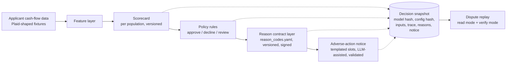

# Explainable Credit Decisioning with FCRA-Grade Reason Codes

A working credit-decisioning engine built to answer one question: when an AI model declines a loan applicant and the applicant disputes it 90 days later, after the model has been retrained twice, can you reproduce the original decision and its legally required reasons, exactly?

Most AI decisioning demos cannot. This one is designed around that moment.

Built by Samidha Visai. Python, scikit-learn, pydantic, SQLite, Streamlit. Clone and run with zero API keys.

## Start with the failure case

A lender adopts AI underwriting. The model is accurate, the explainability dashboard is slick, everyone ships. Ninety days later a declined applicant disputes. Between then and now the model retrained, a feature was renamed, and the compliance team revised the approved reason wording. The lender now has to produce the specific principal reasons for that decline, as they were, under FCRA and ECOA Regulation B.

Three things go wrong in most systems:

1. The "explanation" was a plain-language summary of what the model weighed. Accurate, but not drawn from a compliance-approved reason vocabulary, so it was never a permissible adverse-action reason in the first place.
2. The decision cannot be reconstructed, because the model that made it no longer exists and nobody snapshotted the inputs, the model version, or the reason derivation.
3. The reasons cite signals the applicant never supplied, because a post-hoc explainer ranked whatever features the model happened to use.

This repo is a small, honest, end-to-end demonstration of the architecture that prevents all three.

## The problem, precisely

Regulators have closed the escape hatches. CFPB Circular 2022-03 states that a creditor "cannot justify noncompliance with ECOA and Regulation B's requirements based on the mere fact that the technology it employs to evaluate applications is too complicated or opaque to understand." Circular 2023-03 adds that creditors may not lean on checklist reasons that "do not specifically and accurately indicate the principal reason(s)." SR 11-7 model governance expects decisions to be documented well enough to stand up to independent review.

The industry's working answer is to derive reason codes from post-hoc attribution methods; this is established practice, not a hypothetical (there are issued US patents on generating adverse-action reason codes from SHAP values, and vendors market the capability openly). What is contested is whether that mechanism is sufficient. The FinRegLab and Stanford empirical study of explainability tools in credit underwriting found that tool quality varies widely (the weakest tools performed no better than randomly chosen features), that compressing complex-model explanations into four reasons loses disproportionate information, and, most relevant here, that the study did not evaluate the step where attributions get mapped into the reasons lenders actually state on notices. That unexamined mapping step is where this project lives.

The gap is between explanation and defensibility:

| | Explanation | Defensibility |
|---|---|---|
| Output | Plain-language summary of model behavior | Ranked reasons from an approved vocabulary |
| Vocabulary | Whatever the explainer generates | Versioned, compliance-signed contract |
| Under dispute | Regenerate and hope it matches | Replay the stored derivation, byte for byte |
| Per population | One global explainer | Separate reason sets for thin-file vs full-file |
| Failure mode | True but non-compliant | Unmappable decline fails loudly, pre-launch |

An accurate explanation can still be an illegal adverse-action notice. That distinction is the product.

## Who this is for

The buyer persona is a VP of Credit Risk at a mid-size lender adopting AI underwriting. They are promoted for launching new approval populations and fired for enforcement actions and disputes they cannot reconstruct. Their standing tension: data science wants to ship a better model; compliance cannot sign off on how it explains declines. Every AI decisioning vendor selling into regulated lending inherits this persona's veto.

The insight from having run this process inside a lender: compliance sign-off, not model quality, is the launch gate. A population cannot go live until its reason set and notices are approved. Any decisioning architecture that treats reason codes as a reporting feature, rather than a governed contract in the decision path, discovers this after the deal is signed.

## The core design: a reason-code contract layer

The model proposes; a governed mapping disposes.



Three load-bearing decisions, each with the tradeoff stated:

**1. The reason vocabulary is a config artifact, not code and not model output.** `config/reason_codes_v1.yaml` holds the approved consumer-facing text, per population, with a changelog that carries a sign-off field. A CI gate fails the build if any model feature or decline rule lacks a mapped reason code for its population. Tradeoff: adding a feature now requires a vocabulary change with sign-off. That is not overhead; that is the actual production workflow, made visible.

**2. Contributions are exact, not approximated.** The scorecards are logistic regression on standardized features, so each feature's contribution to a decision is coefficient times value, computed, not estimated by a post-hoc explainer. Tradeoff: a gradient-boosted model would score better. For adverse action, an exact attribution from a weaker model beats an approximate attribution from a stronger one, and correlated features can destabilize even exact attributions, so a bootstrap stability test bounds that risk. See `docs/adr-001-why-not-shap.md`.

**3. Decisions are snapshotted before they are shown.** Every decision persists the model artifact hash, a hash-stamped config version covering both the policy and the reason contract, the full input vector, the rule trace, the ranked reasons, and the notice text, transactionally, before rendering. Replay has two modes: read mode returns the stored record; verify mode recomputes with the pinned model and config and asserts the decision, ranked reason ids, and rule trace match exactly. Read mode is what a dispute needs. Verify mode is what an SR 11-7 reviewer needs, proof of re-derivation rather than a cache read.

## Populations are not an edge case

A thin-file applicant, scored on cash-flow data because they lack bureau history, cannot be declined for "delinquent credit obligations" they never had. This engine routes thin-file applicants to their own reduced-feature scorecard, their own cutoffs, and their own reason set within the contract. One global explanation layer produces reasons that are wrong for at least one population; per-population reason sets are why real lenders run separate sign-offs per launch.

Related design rule: the model uses only features derivable from the applicant's own cash-flow data. Bureau-only features (FICO, inquiry counts) are excluded by design, so no reason code can ever cite an input the applicant never supplied.

## The LLM exhibit: naive vs governed

The demo shows two notice generations side by side:

- **Naive:** hand the LLM the raw features and ask it to explain the decline. The output is fluent, plausible, and non-compliant: unapproved wording, unranked reasons, different text on every run.
- **Governed:** the LLM only selects and orders approved sentence templates keyed by reason-code id and fills constrained slots. Output is validated by exact slot match against the contract; any failure falls back to pure template rendering. The fallback is not a degraded mode, it is the compliance floor.

This is deliberately a thesis exhibit, not a headline feature. No regulated lender should want generative variance in adverse-action notices; the point is to show precisely where an LLM adds polish without adding risk, and where the cage has to be. See `docs/adr-002-templated-notice.md`.

## What I would measure in production

If this shipped as a product surface, the launch metrics are governance metrics:

- **Reason-code coverage rate:** share of declines with a complete mapped reason set. Anything under 100% is a launch blocker, which is why the unmappable-decline path throws instead of logging.
- **Notice validation failure rate:** how often governed generation falls back to templates. Rising rate means the vocabulary and the model drifted apart.
- **Dispute replay fidelity:** verify-mode pass rate across model retrains. The only acceptable number is 100%.
- **Time to approve a new population:** days from model-ready to compliance-signed reason set. This is the metric the contract layer actually improves; at a lender this is weeks of manual mapping work.
- **Per-population decline reason distribution:** the early-warning input for fair-lending review.

## Assumptions this project makes, and their evidence

Product claims deserve the same audit trail as decisions. These are the assumptions underneath this project, graded honestly.

1. **Specific, accurate reasons are legally required; controlled vocabularies are the industry's control, not the law's text.** Reg B requires specific principal reasons (the official commentary notes more than four "is not likely to be helpful"; it is guidance, not a cap). Fixed approved vocabularies are how lenders make that requirement consistent and auditable at scale, because Legal can review 25 phrasings once but cannot review a million generated notices. Evidence: [Circular 2022-03](https://www.consumerfinance.gov/compliance/circulars/circular-2022-03-adverse-action-notification-requirements-in-connection-with-credit-decisions-based-on-complex-algorithms/), [Circular 2023-03](https://files.consumerfinance.gov/f/documents/cfpb_adverse_action_notice_circular_2023-09.pdf), [Reg B comment 9(b)(2)](https://www.consumerfinance.gov/rules-policy/regulations/1002/Interp-9).
2. **Compliance sign-off, not model quality, gates underwriting launches.** First-hand: having run a cash-flow underwriting launch at a fintech lender, introducing a new data source meant enumerating every scenario in which it could decline someone and agreeing approved language before anything shipped. The mapping work sits on the launch's critical path; that is why it deserves architecture rather than spreadsheets.
3. **Attribution-derived reason codes are established but contested practice.** Evidence: issued patents on SHAP-based adverse-action reason codes (e.g. [US 12,050,975](https://patents.google.com/patent/US12050975)), vendor materials marketing the capability, and the [FinRegLab/Stanford study](https://finreglab.org/research/machine-learning-explainability-fairness-insights-from-consumer-lending/) documenting wide tool-quality variance and leaving the attribution-to-reason-code mapping step unevaluated.
4. **Getting notices wrong draws real enforcement.** [CFPB v. LendUp](https://www.consumerfinance.gov/about-us/newsroom/cfpb-shutters-lending-by-vc-backed-fintech-for-violating-agency-order/) (71,800+ adverse-action notices that failed to accurately state reasons; the company stopped lending) and the 2023 Citibank consent order (pretextual denial reasons).
5. **Reproducibility under dispute is an inference, stated as one.** Reg B requires 25 months of record retention and the circulars require accuracy; SR 11-7 expects documentation sufficient for independent review. No public enforcement action yet turns on retraining-induced irreproducibility. This project treats replay as where those obligations converge as models start changing faster than disputes arrive, a design bet, not settled doctrine.
6. **The differentiator is real but narrow.** I found no vendor marketing a governed reason-code contract (versioned vocabulary, per-population sets, sign-off gate) as a first-class product feature. Adjacent capability exists: FICO ships standardized score reason codes, and several vendors sell per-decision reason-code generation. The gap is the governance layer, not the codes themselves.

## Honest limitations

- Demo data is synthetic. The training pipeline documents the exact real-data path (Kaggle LendingClub export, with careful loan_status handling and a survivorship-bias note), and the checked-in artifacts are trained on a clearly labeled synthetic stand-in.
- The demo personas are calibrated: fixtures are tuned so each persona exercises specific reason codes. That is stated in the UI, because a scripted demo that hides its scripting collapses under one probing question, and calibrated test cases are how reason mappings get validated in real life anyway.
- FCRA adverse-action duties attach to decisions based on consumer reports; sandbox fixtures are not consumer reports. This project demonstrates the design pattern and says so. It is not legal advice and not a compliance product.
- Review outcomes route to a manual queue and produce no adverse-action notice here; counteroffer flows are out of scope.

## Running it

```bash
pip install -r requirements.txt
streamlit run app/streamlit_app.py
```

That is the whole setup. Model artifacts, persona fixtures, a seeded demo database with a "last week" decision to dispute, and cached LLM outputs are checked in, so the demo needs zero API keys. Optional: add an OpenAI key in `.env` for live governed generation; run `python scripts/train_model.py --data <lendingclub.csv>` to retrain on real data.

The demo flow: pick a persona, run a decision, read the ranked reason codes and the notice, then open the dispute panel, replay last week's decision, retrain to v2, and watch the original explanation come back unchanged while new decisions use the new model and vocabulary.

## Repo map

```
config/            reason_codes_v1.yaml, v2, policy.yaml   <- the governed artifacts
src/decisioning/   schemas, features, model, rules, reasons, snapshot, notice
scripts/           fixture generator, training, notice cache builder
models/            versioned scorecard artifacts + registry.json (hash-verified)
tests/             the mapping layer and replay tests are the proof of craft
docs/              ADRs: why not SHAP, why the notice is templated
```

## Why I built this

I spent 2.5 years as the PM for credit decisioning and disclosures at a fintech lender, owning the shared decisioning platform through a company-wide cash-flow underwriting launch. The hardest part was never the model. It was producing FCRA-defensible reasons across populations, each requiring separate compliance sign-off, and being able to stand behind any past decision under dispute. This repo is that experience rebuilt clean-room from public sources, because the industry is currently shipping AI decisioning platforms that explain beautifully and defend poorly, and the difference is an architecture decision you have to make on day one.
