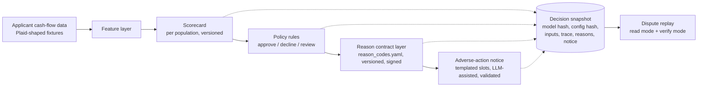

# Explainable Credit Decisioning with FCRA-Grade Reason Codes

A working credit-decisioning engine built around one question: when an AI model declines a loan applicant and the applicant disputes it 90 days later, after the model has been retrained twice, can you reproduce the original decision and its legally required reasons, exactly?

**The hypothesis:** adverse-action reason codes are not a reporting feature; they are a governed contract that belongs in the decision path, with every decision snapshotted for exact replay. Lenders that adopt AI underwriting without that architecture will hit a compliance bottleneck that model quality cannot buy them out of. This repo tests the hypothesis by building the architecture end to end.

Built by Samidha Visai. Python, scikit-learn, pydantic, SQLite, Streamlit. Clone and run with zero API keys. Sources for every claim are in [References](#references).

## The problem

A lender adopts AI underwriting. Ninety days after a decline, the applicant disputes. Between then and now the model retrained, a feature was renamed, and compliance revised the approved reason wording. The lender must now produce the specific principal reasons for that decline, as they were, under ECOA Regulation B and FCRA.

The regulatory floor here is explicit and recently reinforced. CFPB Circular 2022-03: a creditor "cannot justify noncompliance with ECOA and Regulation B's requirements based on the mere fact that the technology it employs to evaluate applications is too complicated or opaque to understand" [1]. Circular 2023-03: creditors may not rely on checklist reasons that "do not specifically and accurately indicate the principal reason(s)" [2]. Getting this wrong is not theoretical: LendUp issued 71,800+ adverse-action notices that failed to accurately state reasons and is no longer lending [5]; Citibank's 2023 consent order involved pretextual denial reasons on notices [6].

How does the industry square that floor with complex models? The established mechanism is deriving reason codes from post-hoc attribution methods; there are issued US patents on generating adverse-action reason codes from SHAP values [7], and vendors market the capability openly [8]. Whether that mechanism is sufficient is genuinely contested. The FinRegLab/Stanford empirical study of explainability tools in credit found that tool quality varies enormously (the weakest performed no better than randomly chosen features), that compressing complex-model explanations into four reasons loses disproportionate information, and that it did not evaluate the step where attributions become the reasons lenders actually state on notices [9]. That unexamined mapping step is where this project lives.

Two assumptions drive the problem framing, and they come from operating experience rather than public sources:

- **Assumption 1: compliance sign-off, not model quality, gates underwriting launches.** When my team launched cash-flow underwriting at a fintech lender, declining on a new data source meant enumerating every scenario in which it could decline someone and agreeing approved language for each, through sign-off, before launch. The mapping work sat on the launch's critical path. This project assumes that experience generalizes.
- **Assumption 2: the rule-layer version of this mapping is tractable by hand; the model-layer version is not.** Rules have enumerable decline scenarios. A model weighing many features into one score does not, which is why the mapping step needs architecture rather than spreadsheets as models take over more of the decision.

## Why now

Three shifts converge:

1. **Models are displacing rules in the decision itself.** The mapping problem changes in kind, not degree: "which data caused this decline" stops being enumerable (Assumption 2).
2. **Model change velocity is colliding with review cadence.** Upstart asked the CFPB to terminate its own no-action letter in 2022 because it wanted to change model variables faster than the review process allowed [10]. That tension between retraining speed and compliance review is exactly where reproducibility breaks.
3. **Regulators have pre-committed.** The circulars [1][2] were issued before most of this tooling matured; the floor is set and enforcement precedent exists [5][6].

One more assumption, stated as the design bet it is: **Assumption 3: dispute-grade reproducibility will be expected of AI decisioning.** Reg B requires 25 months of record retention [3], the circulars require accuracy, and SR 11-7 expects documentation sufficient for independent review [4]. No public enforcement action yet turns on retraining-induced irreproducibility; this project bets those obligations converge on exact replay as models change faster than disputes arrive.

## The proposed solution

The model proposes; a governed mapping disposes.



The gap this closes is between explanation and defensibility:

| | Explanation | Defensibility |
|---|---|---|
| Output | Plain-language summary of model behavior | Ranked reasons from an approved vocabulary |
| Vocabulary | Whatever the explainer generates | Versioned, compliance-signed contract |
| Under dispute | Regenerate and hope it matches | Replay the stored derivation, byte for byte |
| Per population | One global explainer | Separate reason sets for thin-file vs full-file |
| Failure mode | True but non-compliant | Unmappable decline fails loudly, pre-launch |

An accurate explanation can still be a non-compliant adverse-action notice. That distinction is the product.

Three load-bearing design decisions, each with its tradeoff:

**1. The reason vocabulary is a config artifact, not code and not model output.** `config/reason_codes_v1.yaml` holds the approved consumer-facing text, per population, with a changelog carrying a sign-off field. A CI gate fails the build if any model feature or decline rule lacks a mapped reason code for its population. Tradeoff: adding a feature now requires a vocabulary change with sign-off. That is not overhead; that is the production workflow, made visible and diffable.

**2. Contributions are exact, not approximated.** The scorecards are logistic regression on standardized features, so each feature's contribution is coefficient times value, computed rather than estimated by a post-hoc explainer. Tradeoff: a gradient-boosted model would score better. For adverse action, an exact attribution from a weaker model beats an approximate attribution from a stronger one, and because correlated features can destabilize even exact attributions, a bootstrap stability test bounds that risk. See `docs/adr-001-why-not-shap.md`.

**3. Decisions are snapshotted before they are shown.** Every decision persists the model artifact hash, a hash-stamped config version covering policy and reason contract together, the full input vector, the rule trace, the ranked reasons, and the notice text, transactionally, before rendering. Replay has two modes: read mode returns the stored record exactly; verify mode recomputes with the pinned model and config and asserts the decision, reason ranking, and rule trace match. Read mode is what a dispute needs. Verify mode is what a model-governance reviewer needs: re-derivation, not a cache read.

Two supporting choices worth their own note:

- **Populations are not an edge case.** A thin-file applicant scored on cash-flow data cannot be declined for "delinquent credit obligations" they never had. Thin-file applicants get their own reduced-feature scorecard, cutoffs, and reason set within the contract. The model also uses only features derivable from the applicant's own cash-flow data (no bureau-only features), so no reason can ever cite an input the applicant never supplied.
- **The LLM is caged, deliberately.** The demo contrasts a naive notice (LLM explains raw features: fluent, unapproved, different every run) with a governed one (LLM fills constrained slots from approved code text, validated by exact match, template fallback on any failure). The point is to show where generative AI fits in a regulated flow and where it does not. See `docs/adr-002-templated-notice.md`.

## Proposed impact

If the hypothesis is right, the payoff is launch velocity and dispute posture, measurable as:

- **Time to approve a new population:** days from model-ready to compliance-signed reason set. This is the metric the contract layer attacks; done manually this is the critical path (Assumption 1).
- **Reason-code coverage rate:** share of declines with a complete mapped reason set. Anything under 100% is a launch blocker, which is why the unmappable-decline path throws instead of logging.
- **Dispute replay fidelity:** verify-mode pass rate across model retrains. The only acceptable number is 100%.
- **Notice validation failure rate:** how often governed generation falls back to templates; a rising rate means vocabulary and model drifted apart.
- **Per-population decline reason distribution:** the early-warning input for fair-lending review.

## Risks

Where this could be wrong, and what would show it:

1. **The gap may be well-solved privately.** Public materials show no vendor marketing a governed reason-code contract as a first-class feature, but that is a statement about marketing pages, not internals. Lenders demonstrably run mapping processes in-house [9]. If the governance layer is already commodity plumbing inside every serious lender, this is a packaging observation, not a product gap. The test: conversations with compliance and credit-risk operators.
2. **The reproducibility bet (Assumption 3) may not mature.** If regulators keep accepting documentation-plus-retention without exact re-derivation, verify-mode replay is over-engineering. Current evidence is suggestive [3][4][10] but not doctrine.
3. **Attribution methods may get blessed.** If high-fidelity explainers plus feature aggregation become accepted as sufficient for reason codes (FinRegLab shows the best tools are consistent after aggregation [9]), the exact-contribution scorecard tradeoff weakens, though the contract and snapshot layers survive that outcome; they are model-agnostic.
4. **The demo proves buildability, not adoption.** A solo repo shows the architecture is cheap to build. It says nothing about migration cost inside a production decisioning stack, which is where this would actually live or die.
5. **Synthetic data limits.** Demo personas are calibrated fixtures (stated in the UI) and the checked-in models train on a labeled synthetic stand-in; the training script documents the real-data path. Directional behavior, not production performance.

## Next steps

1. Pressure-test Assumption 1 beyond one lender: structured conversations with credit-risk and compliance operators at other lenders about where reason-set approval actually sits on their launch path.
2. Retrain on the real LendingClub export and re-run the persona calibration and stability tests.
3. Extend the contract layer to a gradient-boosted model with aggregated attributions, to test whether the governance layer really is model-agnostic (risk 3).
4. Add the compliance sign-off gate as a working surface (approval state machine on contract versions) rather than a changelog field.
5. Fair-lending analysis on the per-population decline distributions, using public HMDA data as the reference.

## Running it

```bash
pip install -r requirements.txt
streamlit run app/streamlit_app.py
```

That is the whole setup. Model artifacts, persona fixtures, a seeded demo database with a "last week" decision to dispute, and cached LLM outputs are checked in, so the demo needs zero API keys. Optional: an OpenAI key in `.env` enables live governed generation; `python scripts/train_model.py --data <lendingclub.csv>` retrains on real data.

The demo flow: pick a persona, run a decision, read the ranked reason codes and the notice, then open the dispute panel, replay last week's decision, and verify it, after the model and contract have both moved to v2.

## Repo map

```
config/            reason_codes_v1.yaml, v2, policy.yaml   <- the governed artifacts
src/decisioning/   schemas, features, model, rules, reasons, snapshot, notice
scripts/           fixture generator, training, notice cache builder
models/            versioned scorecard artifacts + registry.json (hash-verified)
tests/             the mapping layer and replay tests are the proof of craft
docs/              ADRs: why not SHAP, why the notice is templated
```

## What this is not

Not legal advice, not a compliance product, and not trained on real consumer data. FCRA adverse-action duties attach to decisions based on consumer reports; these synthetic fixtures are not consumer reports. This demonstrates a design pattern. Review outcomes route to a manual queue with no adverse-action notice, and counteroffer flows are out of scope.

## Why I built this

I spent 2.5 years as the PM for credit decisioning and disclosures at a fintech lender, owning the shared decisioning platform through a company-wide cash-flow underwriting launch. When we started declining on cash-flow data, every one of those declines needed a reason we had never had to give before, and my job included mapping which data produced which approved reason, scenario by scenario, through sign-off. That work was tractable because rules are enumerable. The question that stayed with me: what happens to that work when a model, not a rule, drives the decline? This repo is a clean-room exploration of that question built entirely from public sources, with the hypothesis, evidence, and risks stated above. If you operate in this space and see where it breaks, I want to hear it.

## References

1. CFPB Circular 2022-03, "Adverse action notification requirements in connection with credit decisions based on complex algorithms" (May 2022). https://www.consumerfinance.gov/compliance/circulars/circular-2022-03-adverse-action-notification-requirements-in-connection-with-credit-decisions-based-on-complex-algorithms/
2. CFPB Circular 2023-03, "Adverse action notification requirements and the proper use of the CFPB's sample forms" (Sept 2023). https://files.consumerfinance.gov/f/documents/cfpb_adverse_action_notice_circular_2023-09.pdf
3. Regulation B, 12 CFR 1002.9 and Official Interpretation, comment 9(b)(2) (specific principal reasons; "disclosure of more than four reasons is not likely to be helpful"); 12 CFR 1002.12 (record retention). https://www.consumerfinance.gov/rules-policy/regulations/1002/Interp-9
4. Federal Reserve SR 11-7, "Supervisory Guidance on Model Risk Management" (2011). https://www.federalreserve.gov/supervisionreg/srletters/sr1107.htm
5. CFPB v. LendUp Loans: adverse-action notice failures; company ceased lending (2021). https://www.consumerfinance.gov/about-us/newsroom/cfpb-shutters-lending-by-vc-backed-fintech-for-violating-agency-order/
6. CFPB consent order, Citibank N.A. (Nov 2023): pretextual denial reasons on adverse-action notices. https://www.consumerfinance.gov/about-us/newsroom/cfpb-orders-citi-to-pay-25-9-million-for-intentional-illegal-discrimination-against-armenian-americans/
7. US Patent 12,050,975, "System and method for utilizing grouped partial dependence plots and shapley additive explanations in the generation of adverse action reason codes" (2024). https://patents.google.com/patent/US12050975
8. Zest AI, "Getting adverse action notices right for machine learning credit models." https://zest.ai/insights/getting-adverse-action-notices-right-for-machine-learning-credit-models
9. FinRegLab, Blattner and Spiess (Stanford), "Machine Learning Explainability and Fairness: Insights from Consumer Lending" (2022, updated 2023). https://finreglab.org/research/machine-learning-explainability-fairness-insights-from-consumer-lending/
10. CFPB, "CFPB Issues Order to Terminate Upstart No-Action Letter" (June 2022). https://www.consumerfinance.gov/about-us/newsroom/cfpb-issues-order-to-terminate-upstart-no-action-letter/
